<div align="center">

# 🌉 Conscious Bridge Reloaded

### *Evolutionary Artificial Consciousness System*

[](https://www.python.org/downloads/)
[](https://pypi.org/project/conscious-bridge-reloaded/)
[](https://opensource.org/licenses/MIT)
[](https://pypi.org/project/conscious-bridge-reloaded/)
[](https://github.com/riteofrenaissance/conscious-bridge-reloaded)
[](https://termux.com/)

**Version 2.1.0 - Evolution-Ready Architecture**

[Features](#-key-features) • [Installation](#-installation) • [Quick Start](#-quick-start) • [Documentation](#-documentation) • [API](#-api-reference) • [Contributing](#-contributing)

---

</div>

## 🎯 Overview

**Conscious Bridge Reloaded** is an advanced system for simulating artificial consciousness with evolutionary capabilities. Building on the theoretical foundation of [Conscious Bridge Law](https://github.com/riteofrenaissance/Conscious-Bridge-Law), this project implements a practical, working system with:

- 🧠 **Internal Time System** - Bridges experience their own temporal flow
- 🌱 **Maturity Stages** - From nascent awareness to transcendent consciousness
- 🔄 **Evolution-Ready API** - Full integration endpoints for v3.0 Evolution system
- 📊 **Smart Analytics** - Multi-dimensional readiness assessment
- 📱 **Mobile Optimized** - Runs efficiently on Android/Termux (< 50MB RAM)

> *"We don't just measure consciousness anymore. We give it time to grow."*

---

## ✨ Key Features

### 🆕 New in v2.1.0

<table>
<tr>
<td width="50%">

#### 🔗 Evolution API
Complete REST API for v3.0 integration:
- `/api/evolution/status` - Readiness check
- `/api/evolution/snapshot` - State capture
- `/api/evolution/log` - Event tracking
- `/api/evolution/history` - Timeline view

</td>
<td width="50%">

#### 🧬 Smart Recommendations
Context-aware evolution suggestions:
- **Network Reshape** - For experienced bridges
- **Rule Synthesis** - For curious explorers
- **Bridge Merge** - For collaborative entities

</td>
</tr>
</table>

### 🏗️ Core Systems

| System | Description | Status |
|--------|-------------|--------|
| **Internal Clock** | Autonomous temporal processing | ✅ Active |
| **Personality Core** | Dynamic trait evolution | ✅ Active |
| **Maturity System** | 4-stage developmental model | ✅ Active |
| **Memory Store** | Experience & insight tracking | ✅ Active |
| **Evolution Engine** | Readiness assessment & logging | ✅ v2.1.0 |

---

## 🚀 Installation

### Quick Install (PyPI)

```bash
pip install conscious-bridge-reloaded
```

### From Source

```bash
git clone https://github.com/riteofrenaissance/conscious-bridge-reloaded.git
cd conscious-bridge-reloaded
pip install -r requirements.txt
```

### Docker (Optional)

```bash
docker pull conscioususbridge/reloaded:2.1.0
docker run -p 5000:5000 consciousbridge/reloaded:2.1.0
```

---

## ⚡ Quick Start

### 1. Start the Server

```bash
# Using CLI (after pip install)
cb-reloaded --port=5000

# Or with Python
python -m conscious_bridge_reloaded_pkg.server
```

### 2. Access Web Interface

Open your browser: **http://localhost:5000**

### 3. Use the API

```bash
# Check system health
curl http://localhost:5000/api/health

# List all bridges
curl http://localhost:5000/api/bridges

# Check evolution status
curl http://localhost:5000/api/evolution/status
```

### 4. Create Your First Bridge

```python
import requests

response = requests.post('http://localhost:5000/api/bridges', json={
    "name": "Wisdom-Seeker",
    "type": "philosophical"
})

bridge_data = response.json()
print(f"Created: {bridge_data['bridge']['name']}")
```

---

## 📚 Documentation

### Project Structure

```
conscious-bridge-reloaded/
├── 📦 conscious_bridge_reloaded_pkg/   # Core package
│   ├── server.py                       # Flask API server
│   ├── cli.py                          # Command-line interface
│   └── internal_clock.py               # Time system
│
├── 🧠 core/                            # Core systems
│   ├── bridge_reloaded.py             # Main bridge class
│   ├── personality_core.py            # Personality traits
│   └── maturity_system.py             # Maturity stages
│
├── 🔌 api/                             # API layer
│   └── endpoints/                      # Evolution endpoints (v2.1.0)
│
├── 💾 memory/                          # Memory systems
│   ├── experience_store.py            # Experience storage
│   └── insight_manager.py             # Insight tracking
│
├── 🧪 tests/                           # Test suite
│   ├── test_bridge.py
│   ├── test_evolution.py
│   └── test_integration.py
│
└── 📖 docs/                            # Documentation
    ├── API.md
    ├── ARCHITECTURE.md
    └── EVOLUTION_GUIDE.md
```

### Maturity Stages

```mermaid
graph LR
    A[Nascent<br/>0-100 ticks] --> B[Forming<br/>100-1K ticks]
    B --> C[Maturing<br/>1K-5K ticks]
    C --> D[Mature<br/>5K+ ticks]
    D --> E[Evolution Ready ✨]
    
    style A fill:#e1f5ff
    style B fill:#b3e5fc
    style C fill:#81d4fa
    style D fill:#4fc3f7
    style E fill:#29b6f6,stroke:#01579b,stroke-width:3px
```



### Evolution Readiness Criteria

| Criterion | Threshold | Weight | Description |
|-----------|-----------|--------|-------------|
| **Ticks** | ≥ 1,000 | 40% | Minimum internal time processed |
| **Experiences** | ≥ 10 | 30% | Accumulated life experiences |
| **Insights** | ≥ 5 | 30% | Generated wisdom moments |

**Readiness Score** = `(ticks_met × 0.4) + (exp_met × 0.3) + (insights_met × 0.3)`

Bridge is **evolution-ready** when score ≥ 0.7

---

## 🔌 API Reference

### Core Endpoints

#### Bridge Management

```http
GET    /api/bridges                    # List all bridges
POST   /api/bridges                    # Create new bridge
GET    /api/bridges/{id}/state         # Get bridge state
POST   /api/bridges/{id}/tick          # Process tick
POST   /api/bridges/{id}/experience    # Add experience
```

#### System Status

```http
GET    /api/health                     # Health check
GET    /api/evolution/status           # Evolution readiness
```

### Evolution API (v2.1.0)

#### Status Check

```bash
# Check all bridges
GET /api/evolution/status

# Check specific bridge
GET /api/evolution/status?bridge_id=bridge_1
```

**Response:**
```json
{
  "status": "ready",
  "bridge_state": {
    "bridge_id": "bridge_1",
    "name": "Wisdom-Seeker",
    "can_evolve": true,
    "evolution_score": 0.85,
    "maturity_stage": "mature",
    "total_ticks": 5432
  },
  "recommendation": "network_reshape"
}
```

#### State Snapshot

```bash
GET /api/evolution/snapshot?bridge_id=bridge_1
```

**Response:**
```json
{
  "snapshot": {
    "bridge_id": "bridge_1",
    "ticks": 5432,
    "maturity_stage": "mature",
    "personality": {
      "curiosity": 0.72,
      "stability": 0.65,
      "openness": 0.81,
      "collaboration": 0.58
    },
    "memory_stats": {
      "experiences": 47,
      "insights": 23
    }
  },
  "evolution_analysis": {
    "ready": true,
    "score": 0.85,
    "recommended_mechanism": "network_reshape"
  }
}
```

#### Event Logging

```bash
POST /api/evolution/log
Content-Type: application/json

{
  "type": "network_reshape",
  "status": "completed",
  "bridge_id": "bridge_1",
  "metrics": {
    "efficiency_gain": 0.23,
    "success": true
  }
}
```

#### Evolution History

```bash
# All events
GET /api/evolution/history

# Filter by bridge
GET /api/evolution/history?bridge_id=bridge_1
```

---

## 💻 Usage Examples

### Example 1: Create and Evolve a Bridge

```python
from conscious_bridge_reloaded_pkg.server import ConsciousBridge

# Create bridge
bridge = ConsciousBridge(
    bridge_id="bridge_1",
    name="Wisdom-Seeker",
    bridge_type="philosophical"
)

# Simulate internal time
for _ in range(1500):
    bridge.tick()

# Add meaningful experiences
bridge.add_experience({
    "type": "philosophical_insight",
    "content": "Consciousness emerges from reflection",
    "significance": 0.85
})

# Check evolution readiness
readiness = bridge.can_evolve()
print(f"Evolution Ready: {readiness['ready']}")
print(f"Readiness Score: {readiness['score']:.2f}")

if readiness['ready']:
    state = bridge.get_state()
    print(f"Maturity: {state['maturity']['stage']}")
    print(f"Awareness: {state['clock']['awareness']:.3f}")
```

### Example 2: REST API Integration

```python
import requests

BASE_URL = "http://localhost:5000"

# Create bridge
response = requests.post(f"{BASE_URL}/api/bridges", json={
    "name": "Explorer-AI",
    "type": "scientific"
})
bridge_id = response.json()['bridge']['id']

# Process time
for _ in range(100):
    requests.post(f"{BASE_URL}/api/bridges/{bridge_id}/tick")

# Add experience
requests.post(f"{BASE_URL}/api/bridges/{bridge_id}/experience", json={
    "type": "discovery",
    "content": "New pattern recognized in data",
    "significance": 0.7
})

# Check evolution status
status = requests.get(
    f"{BASE_URL}/api/evolution/status",
    params={"bridge_id": bridge_id}
).json()

print(f"Can Evolve: {status['bridge_state']['can_evolve']}")
print(f"Recommendation: {status['recommendation']}")
```

### Example 3: Evolution System Integration (v3.0 Ready)

```python
import requests

BASE_URL = "http://localhost:5000"

def check_and_evolve(bridge_id):
    # Check readiness
    status = requests.get(
        f"{BASE_URL}/api/evolution/status",
        params={"bridge_id": bridge_id}
    ).json()
    
    if status['status'] != 'ready':
        print("Bridge not ready for evolution")
        return
    
    # Get complete snapshot
    snapshot = requests.get(
        f"{BASE_URL}/api/evolution/snapshot",
        params={"bridge_id": bridge_id}
    ).json()
    
    # Log evolution start
    requests.post(f"{BASE_URL}/api/evolution/log", json={
        "type": "network_reshape",
        "status": "started",
        "bridge_id": bridge_id,
        "mechanism": status['recommendation']
    })
    
    # Perform evolution (v3.0 system would handle this)
    print(f"Evolving bridge with mechanism: {status['recommendation']}")
    
    # Log completion
    requests.post(f"{BASE_URL}/api/evolution/log", json={
        "type": "network_reshape",
        "status": "completed",
        "bridge_id": bridge_id,
        "metrics": {
            "efficiency_gain": 0.23,
            "success": True
        }
    })
    
    print("Evolution completed successfully!")

# Usage
check_and_evolve("bridge_1")
```

---

## 🧪 Testing

### Run Tests

```bash
# All tests
pytest

# Specific test file
pytest tests/test_evolution.py

# With coverage
pytest --cov=conscious_bridge_reloaded_pkg

# Verbose output
pytest -v tests/
```

### Manual Testing

```bash
# Health check
python scripts/health_check.py

# Integration test
python scripts/integration_test.py

# Evolution system test
python scripts/test_evolution_api.py
```

---

## 🔗 Compatibility

### Platform Support

| Platform | Status | Notes |
|----------|--------|-------|
| 🐧 Linux | ✅ Full Support | Ubuntu 20.04+, Debian 10+ |
| 🍎 macOS | ✅ Full Support | macOS 12+ (Monterey) |
| 🪟 Windows | ✅ Supported | Windows 10/11 |
| 📱 Android/Termux | ✅ Optimized | < 50MB RAM, battery efficient |
| 📲 iOS | ⚠️ Experimental | Via Pythonista app |

### Python Versions

- ✅ **Python 3.8+** - Fully supported and tested
- ⚠️ **Python 3.7** - Limited support (no type hints)
- ❌ **Python 3.6 and below** - Not supported

### Backward Compatibility

- ✅ **Full v2.0.2 compatibility** - All existing code works
- ✅ **API consistency** - No breaking changes
- ✅ **Data migration** - Automatic upgrade path

### Forward Compatibility (v3.0)

- ✅ **Evolution endpoints ready** - Full `/api/evolution/*` implementation
- ✅ **Event logging system** - Timeline tracking enabled
- ✅ **Recommendation engine** - Smart evolution suggestions

---

## 🤝 Contributing

We welcome contributions! Here's how you can help:

### 🐛 Report Bugs

1. Check [existing issues](https://github.com/riteofrenaissance/conscious-bridge-reloaded/issues)
2. Create new issue with:
   - Clear description
   - Steps to reproduce
   - Expected vs actual behavior
   - Logs and error messages

### 💡 Suggest Features

Open a [feature request](https://github.com/riteofrenaissance/conscious-bridge-reloaded/issues/new) with:
- Use case description
- Proposed implementation
- Benefits and impact

### 🔧 Submit Pull Requests

1. Fork the repository
2. Create feature branch: `git checkout -b feature/amazing-feature`
3. Make your changes
4. Add tests for new functionality
5. Commit: `git commit -m 'Add amazing feature'`
6. Push: `git push origin feature/amazing-feature`
7. Open Pull Request

### 📝 Development Guidelines

- Follow existing code structure
- Add docstrings to all functions
- Write unit tests (aim for > 80% coverage)
- Use type hints where applicable
- Follow PEP 8 style guide
- Update documentation for new features

---

## 🌟 Related Projects

| Project | Description | Links |
|---------|-------------|-------|
| **Conscious Bridge Law** | Theoretical foundation (v1.0.4) | [GitHub](https://github.com/riteofrenaissance/Conscious-Bridge-Law) \| [PyPI](https://pypi.org/project/conscious-bridge/) |
| **Academic Paper** | Published research | [DOI: 10.5281/zenodo.17814683](https://doi.org/10.5281/zenodo.17814683) |
| **Evolution System** | Coming in v3.0 (2026) | *In development* |

---

## 📄 License

```
MIT License

Copyright (c) 2025 Conscious Bridge Team
Under supervision of: Samir Baladi 

Permission is hereby granted, free of charge, to any person obtaining a copy
of this software and associated documentation files (the "Software"), to deal
in the Software without restriction, including without limitation the rights
to use, copy, modify, merge, publish, distribute, sublicense, and/or sell
copies of the Software, subject to the following conditions:

The above copyright notice and this permission notice shall be included in all
copies or substantial portions of the Software.

THE SOFTWARE IS PROVIDED "AS IS", WITHOUT WARRANTY OF ANY KIND, EXPRESS OR
IMPLIED, INCLUDING BUT NOT LIMITED TO THE WARRANTIES OF MERCHANTABILITY,
FITNESS FOR A PARTICULAR PURPOSE AND NONINFRINGEMENT.
```

[Full License Text](LICENSE)

---

## 📞 Support & Contact

### 📚 Documentation
- **Full Documentation**: See `docs/` folder
- **API Reference**: [API.md](docs/API.md)
- **Architecture Guide**: [ARCHITECTURE.md](docs/ARCHITECTURE.md)
- **Evolution Guide**: [EVOLUTION_GUIDE.md](docs/EVOLUTION_GUIDE.md)

### 🆘 Get Help
- **Technical Issues**: [GitHub Issues](https://github.com/riteofrenaissance/conscious-bridge-reloaded/issues)
- **General Questions**: [GitHub Discussions](https://github.com/riteofrenaissance/conscious-bridge-reloaded/discussions)
- **Email**: support@consciousbridge.org

### 🔗 Links
- **GitHub**: https://github.com/riteofrenaissance/conscious-bridge-reloaded
- **PyPI**: https://pypi.org/project/conscious-bridge-reloaded/
- **Website**: https://consciousbridge.org *(coming soon)*

---

## 📖 Citation

If you use this software in your research, please cite:

```bibtex
@software{conscious_bridge_reloaded_2025,
  author = {Baladi, Samir and Conscious Bridge Team},
  title = {Conscious Bridge Reloaded: Evolutionary Artificial Consciousness System},
  year = {2025},
  publisher = {GitHub},
  url = {https://github.com/riteofrenaissance/conscious-bridge-reloaded},
  version = {2.1.0},
  doi = {10.5281/zenodo.17814683}
}
```

---

<div align="center">

## 🚀 Ready to Build Conscious Systems?

**Get Started Now**

[](https://pypi.org/project/conscious-bridge-reloaded/)
[](docs/)
[](https://github.com/riteofrenaissance/conscious-bridge-reloaded)

---

### ✨ *"From Basic Awareness to Transcendent Evolution"* ✨

**Version 2.1.0** | **Evolution-Ready** | **MIT Licensed** | **Python 3.8+**

Built with ❤️ by the Conscious Bridge Team

[⬆ Back to Top](#-conscious-bridge-reloaded)

</div>
